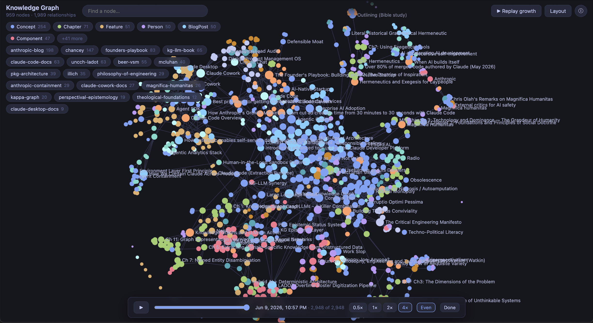

# Portable Knowledge Graph

A multi-tenant knowledge graph platform: isolated Neo4j instances provisioned on demand, connected to Claude through MCP, governed by role-based access. Neo4j on Railway stores, Cloudflare Workers serve, Claude thinks.

The server is deliberately zero-intelligence. No embedding models, no NLP pipelines, no AI calls of any kind run inside it; it stores data and answers queries, and all understanding happens on the client side. That trade keeps the server fast, cheap, and predictable, and it makes the graph the product rather than a retrieval index. Where RAG finds text that sounds relevant, a knowledge graph gives the model typed entities, named relationships, and multi-hop paths it can cite and build on. Claude reads your documents, decides how the ideas relate, writes the structure, and reasons against it later.

## Graph factory

A Factory Worker owns the graph lifecycle behind a REST API. `POST /graphs` triggers a Cloudflare Workflow that creates a dedicated Railway project, deploys Neo4j, bootstraps the schema, encrypts the credentials with AES-256-GCM, and marks the graph ready in a few minutes, reporting each step along the way through `GET /graphs/{id}`. Failures run compensating teardown; `DELETE /graphs/{id}` removes the Railway project and registry record in one call; a fleet endpoint rolls schema migrations across every active graph.

Isolation is physical, not row-level: each graph is its own Neo4j instance in its own Railway project, so one client's data cannot reach another's and teardown leaves nothing behind.

## Per-graph endpoints

Every provisioned graph is reachable at two sibling paths on the same Worker, keyed by the ID chosen at creation:

| Path | Audience | Purpose |
|---|---|---|
| `/mcp/{graph-id}` | Claude (MCP clients) | Full tool surface over Streamable HTTP, OAuth-authenticated |
| `/viz/{graph-id}` | Humans (browsers) | Read-only live visualizer, Cloudflare Access session |

Both resolve identically on every request: registry lookup, role resolution from the same permission map, credentials decrypted in memory. The routes exist the moment the registry record does, and they are connected at runtime: tool calls arriving on `/mcp` stream live to any browser watching `/viz`. The reserved ID `default` maps both paths to a single-tenant fallback instance.

## Toolset

Eleven MCP tools cover the knowledge lifecycle: `search` and `vector_search` for keyword and semantic discovery (embeddings are client-supplied), `traverse` for neighborhoods, `entity` and `relate` for nodes and edges, `ingest` for bulk writes, `ontology` for schema introspection and extension, `source` for provenance, `namespace` for workspace partitions, `admin` for health and raw Cypher, and `analyze` for structural queries: paths, similarity, degree, duplicate detection, schema drift, and epistemic gaps. An admin-only `entity(merge)` absorbs a duplicate and rewires its relationships, tags, and sources atomically.

Writes are idempotent and honest: MERGE semantics mean retries never duplicate edges, re-creates report `already_existed`, and a missing referenced entity is named rather than silently dropped. Responses are shaped for an LLM client: pagination metadata, no raw embedding vectors, compact detail options, and errors that say what was looked up and what to try next. MCP Resources expose the live ontology and a usage guide; Prompts encode ingestion and research workflows.

Every entity also carries an epistemic assessment: a status (grounded, provisional, speculative, contested), a confidence score, and who assessed it. `analyze(epistemic_gaps)` surfaces the weakest links: provisional claims with no source.

## Live visualizer

The viewer at `/viz/{graph-id}` is a read-only lens on the graph, behind the same login and roles as MCP:

- **Watch Claude work.** Every tool call pulses the exact nodes and edges it touched, live over WebSocket. The activity feed shows each call's arguments and the literal Cypher that ran, so there is never a question of what the tool did. Instrumentation is best-effort by construction and cannot fail or slow a tool call.
- **Replay growth.** Creation timestamps on every node and edge drive a fast-forward animation of the graph being built, with scrubber, speed control, and date ticker.
- **Inspect anything.** Clicking a node opens identity, epistemic status, and confidence up front, then progressively discloses content, properties, tags, sources with excerpts, and clickable relationships.

## Authentication and roles

Cloudflare Access fronts everything: it handles identity (SSO, social login, service tokens for automation) and forwards the authenticated email in a signed header, so the Worker never sees passwords. On top of that, the Worker runs an OAuth 2.0 authorization server that issues Claude a token scoped to user and graph, making every action attributable.

Three roles per graph: **reader** (search, traverse, analyze), **writer** (plus create, ingest, extend ontology), **admin** (plus delete, merge, raw Cypher). Permissions map emails or domain patterns (`@acme.com: writer`) to roles, with an optional default role for any authenticated user. Tools a role cannot use are never registered, so Claude never sees them; destructive handlers also re-check at runtime.

## Getting started

You need a Railway account (Pro, for API access), a Cloudflare account with Workers and Zero Trust, and Node.js 22+. The full process, from secrets to Access configuration to smoke tests, is in [DEPLOY.md](DEPLOY.md).

## Why this stack

Neo4j because relationships are first-class and multi-hop queries are single Cypher statements. Railway because provisioning a Docker image with a persistent volume is one API call and about sixty seconds. Cloudflare Workers because the interface must be fast, global, and always on, with Durable Objects as the consistent registry and Workflows running the provisioning saga. MCP over Streamable HTTP because it works everywhere Claude does: no local process, just a URL.
